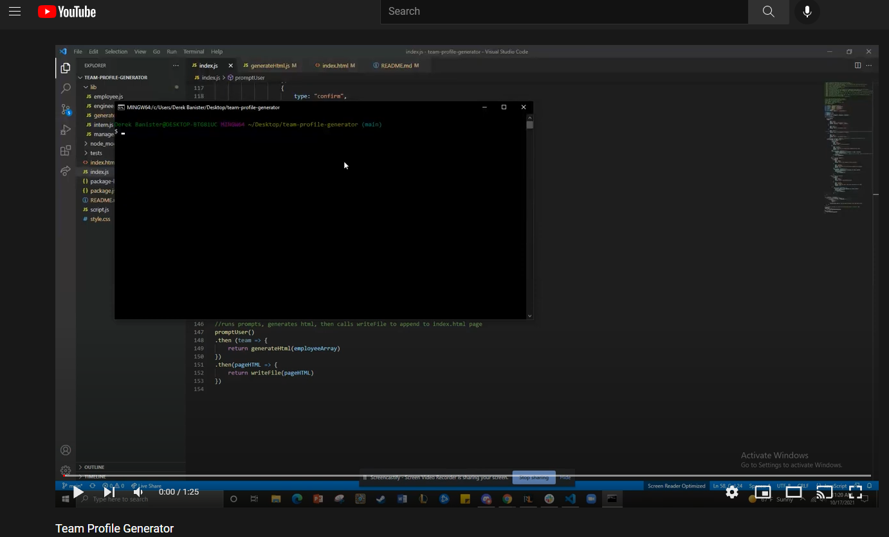

# Team Profile Generator

**My Team Profile Generator is a command line application that takes in user inputs and creates an html page based on those inputs. The inputs in this application revolve around assembling your programming team. You have 3 role selections, which include Manager, Engineer, and Intern. Each role has specific traits with Manager's having office numbers, Engineer's have Github links with their repositories linked, and Intern's have their school listed. Along with that specific info, Name's, roles, e-mail's, and ID's are also supported inputs.**

***

## Click on the image below to see the application in action.

## Built With

* [Javascript](https://www.javascript.com/)
* [Node.JS](https://nodejs.org/en/)
* [NPM Inquirer](https://www.npmjs.com/package/inquirer)
* [Jest](https://jestjs.io/)

## Instructions
Steps to install application:

1. Clone repository.
2. Enter the directory with index.js run npm install
3. Run NPM Start in command line, make sure Node.JS is installed.
4. Answer prompts
5. HTML File will be generated with styling, formatting, and the information you entered

## Authors

* **DEREK BANISTER** 

- [Link to Portfolio Site](https://derekbanister.github.io/First-Portfolio/)
- [Link to Github](https://github.com/DerekBanister)
- [Link to LinkedIn](https://www.linkedin.com/in/derek-banister/)

